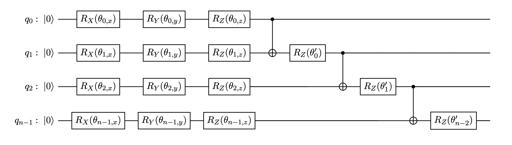
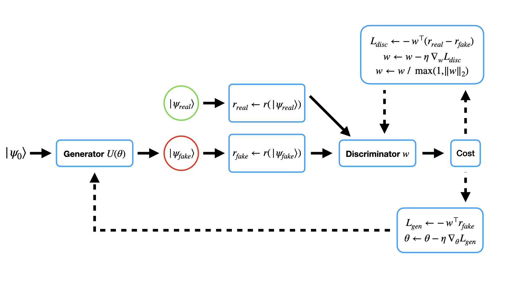
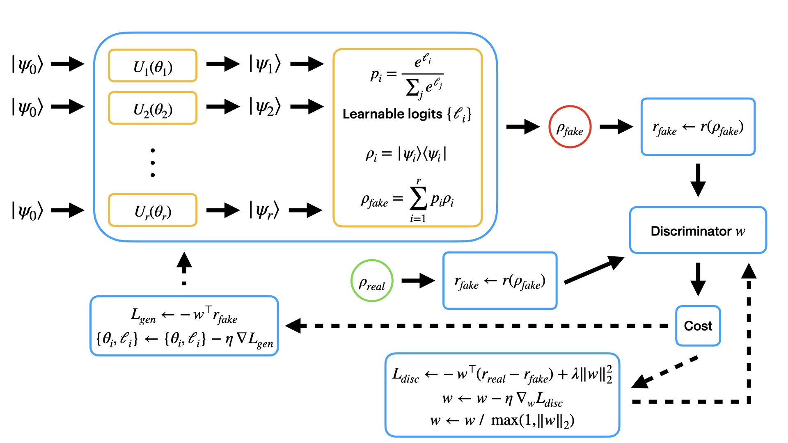

# Bloch-WGAN

**Bloch–Wasserstein Generative Adversarial Network for Quantum State Learning**

*Kashyap Patel · Bhavin Makwana · Manjunath Joshi*  
*Dhirubhai Ambani University, Gandhinagar, India*

---


## Overview

Bloch-WGAN is a hybrid quantum–classical GAN for learning unknown pure and mixed quantum states. It sidesteps the two main bottlenecks of existing Quantum WGANs (QWGAN) — semidefinite programming (SDP) and matrix-exponential regularisation — by working entirely in the generalized Bloch vector space.

**Key idea:** embed any *n*-qubit state into $ \mathbb{R}^D $ via Pauli expectation values, then apply the classical Wasserstein-1 objective with a linear critic. The quantum generator is a parameterized quantum circuit (PQC); the discriminator is a single weight vector with a norm-clipping Lipschitz constraint.

---

## Highlights

- **Numerically stable** at 8 qubits — no NaN values, unlike prior QWGAN methods
- **No SDP or matrix exponential** — replaced by an O(D) dot product
- **Mean fidelity > 0.99** for pure states up to 4 qubits and mixed states up to 2 qubits (50 independent runs)
- **Median fidelity 0.992** at 8 qubits
- **Quadratic regularizer** for mixed-state learning that distributes gradient signal across all Pauli directions and prevents catastrophic failures

---

## Architecture

### Parameterized Quantum Circuit



The pure-state generator circuit for $n$ qubits consists of two main components: a rotation layer and an entangling layer.

* **Rotation Layer:**
  Each qubit is parameterized using three single-qubit rotations: $R_X$, $R_Y$, and $R_Z$.
  This contributes a total of $3n$ trainable parameters.

* **Entangling Layer:**
  Adjacent qubits are connected through cascading CNOT gates. After each CNOT operation, an additional $R_Z$ rotation is applied, contributing $n-1$ trainable parameters.

Overall, the circuit contains:

$$
4n - 1
$$

trainable parameters in total.

### Pure State



The quantum generator $U(\theta)$ transforms the reference state $ |\psi_0\rangle $ into a generated quantum state $ |\psi_{\text{fake}}\rangle $. This state is mapped to its Bloch vector representation $ r_{\text{fake}} = r(|\psi_{\text{fake}}\rangle) $, which is then compared with the target Bloch vector $ r_{\text{real}} = r(|\psi_{\text{real}}\rangle) $ using a classical linear discriminator parameterized by $ w $. The resulting scalar output defines the Wasserstein loss. Solid arrows represent the forward propagation through the model, while dashed arrows indicate gradient flow used to update the discriminator parameters via $ \nabla_w L_{\text{disc}} $ and the generator parameters via $ \nabla_\theta L_{\text{gen}} $.

### Mixed State



The mixed-state Bloch-WGAN employs a collection of parameterized quantum circuits $ {U_i(\theta_i)}_{i=1}^{r} $, each preparing a pure quantum state $ |\psi_i\rangle $. Their corresponding density matrices $ \rho_i = |\psi_i\rangle\langle\psi_i| $ are combined using a learnable softmax probability distribution

$$
p_i = \frac{e^{\ell_i}}{\sum_j e^{\ell_j}},
$$

where $ {\ell_i} $ are trainable mixing logits. The generator output is therefore

$$
\rho_{\text{fake}} = \sum_{i=1}^{r} p_i \rho_i.
$$

The Bloch vector representations $ r_{\text{fake}} $ and $ r_{\text{real}} $ are evaluated by a classical linear discriminator $ w $. The discriminator objective includes a quadratic regularization term $ \lambda |w|_2^2 $, followed by a unit-norm projection step

$$
w \leftarrow \frac{w}{\max(1,|w|_2)}.
$$

Solid arrows denote the forward computational flow, while dashed arrows represent backpropagation. During training, the generator update jointly optimizes both the circuit parameters $ \theta_i $ and the mixing logits $ \ell_i $.

---

## Results

### Pure States (50 runs per configuration)

| Qubits | Mean   | Median | Std    | Runs > 0.99 |
|:------:|:------:|:------:|:------:|:-----------:|
| 1      | 0.9998 | 0.9999 | 0.0005 | 50 / 50     |
| 2      | 0.9989 | 0.9998 | 0.0019 | 50 / 50     |
| 3      | 0.9656 | 0.9959 | 0.1399 | 34 / 50     |
| 4      | 0.9895 | 0.9987 | 0.0331 | 45 / 50     |
| 8      | 0.8740 | 0.9916 | 0.3450 | 27 / 50     |

### Mixed States — Regularized $\lambda=0.1$ vs. No Regularization (50 runs)

| Qubits | Reg   | Mean (Reg / NR) | Median (Reg / NR) | Min (Reg / NR)  |
|:------:|:-----:|:---------------:|:-----------------:|:---------------:|
| 1      | ✅ / ❌ | 0.9945 / 0.9600 | 0.9953 / 0.9778   | 0.9806 / 0.8141 |
| 2      | ✅ / ❌ | 0.9889 / 0.9829 | 0.9996 / 0.9926   | 0.7823 / 0.8402 |
| 3      | ✅ / ❌ | 0.9335 / 0.9290 | 0.9987 / 0.9926   | 0.7326 / 0.2250 |

---

## Comparison with QWGAN

| Aspect        | QWGAN                              | Bloch-WGAN                            |
|---------------|------------------------------------|----------------------------------------|
| Architecture  | Fully quantum                      | Hybrid (quantum generator + classical discriminator) |
| Distance      | Quantum $W_1$ semimetric           | $\ell_2$ distance in Bloch space |
| Discriminator | Two Hermitian operators $\phi, \psi$ | Single vector $\mathbf{w} \in \mathbb{R}^D$ |
| Regularizer   | Entropic $\xi_R$ (matrix exponential) | Quadratic $\lambda \|\mathbf{w}\|_2^2$ |
| Lipschitz     | SDP constraint                     | Norm clipping $\|\mathbf{w}\|_2 \le 1$ |
| Scalability   | $\mathcal{O}(2^{2n})$ matrix exponential + SDP | $\mathcal{O}(D)$ dot product |

---

## Repository Structure

```
Bloch-WGAN/
├── notebooks/
│   ├── bloch-wgan.ipynb
│   └── logs.ipynb
├── CITATION.cff
├── LICENSE
└── README.md
```

---

## Citation

```bibtex
@inproceedings{patel2026blochwgan,
  title     = {Bloch--{W}asserstein Generative Adversarial Network for Quantum State Learning},
  author    = {Patel, Kashyap and Makwana, Bhavin and Joshi, Manjunath},
  year      = {2026},
  note      = {Dhirubhai Ambani University}
}
```

---

## License

[MIT](LICENSE)